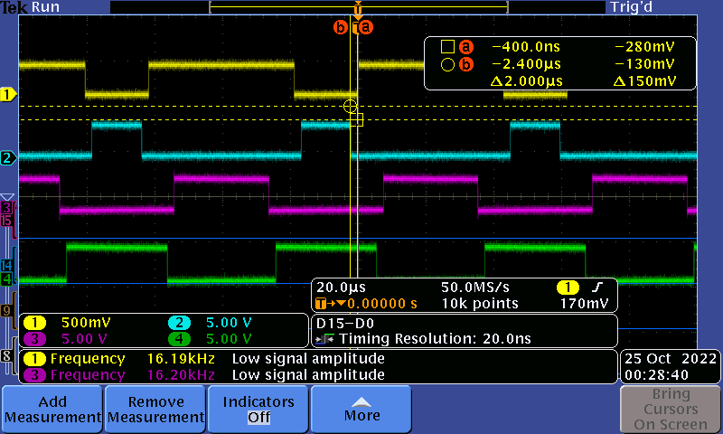

# TP Actionneur et Automatique Appliquée

La documentation *doxygen* du projet peut être trouvée [ici](https://lucas-vallery.github.io/tp_actionneur_et_automatique_appliquee/html/)

## Table des matières

- [Introduction](#introduction)
- [Configuration du microcontrôleur](#Configuration-du-microcontrôleur)
- [Console UART](#Console-UART)
- [TP1 - Commande MCC Classique](#TP1---commande-mcc-classique)
- [TP2 - Mesure de vitesse et de courant](#tp2---mesure-de-vitesse-et-de-courant)
- [Conclusion](#conclusion)

## Introduction

L'objectif de ces 3 séances de TP était de réaliser : 
- Un shell pour interfacer le hacheur, la STM32 et notre PC
- La commande des 4 transistors du hâcheur en commande complémentaire décalée
- L'acquisition du courant dans un bras de pont et de la vitesse du moteur

## Configuration du microcontrôleur

Le microncontrôleur est configuré comme suit :

* L'horloge HCLK est configurée à 170 Mhz. Les bus APBx péripheriques et APBx timers sont configuré à 170 Mhz.
* Le *timer* 1 est utilisé pour générer les PWMs de commande :
  * *Prescaler* à 2
  * *Counter Mode* à *Center Aligned mode 1*
  * *Counter Period* à 1750
  * *auto-reload preload* à *Enable*
  * Génére un *Update Event*
  * *Dead Time* à 203
  * Le pulse des deux *channels* des PWMs à 875 (alpha = 50%)
  * Les PWMs sont générées sur les broches suivantes :
    |*Channel*  |Broche   |Hacheur	|
    |-----------|---------|---------|
    |CH1        |PA8      |Y_TOP	|
    |CH2        |PA9      |B_TOP	|
    |CH1N       |PA11     |Y_BOTTOM	|
    |CH2N       |PA12     |B_BOTTOM	|
  * Tous les autres paramètres sont laissés par défaut
* Le *timer* 3 est utilisé en *Encode Mode*
  * *Encoder Mode* à *Encoder Mode TI1 and TI2*
  * Tous les autres paramètres sont inchangés
* Le *timer* 4 génére des interruptions qui nous permettent de mesurer la vitesse de rotation du moteur
  * *Prescaler* à 170
  * *Counter Period* à 1000
* L'ADC1 est configuré pour fonctionner avec le DMA
  * *DMA Continuous Request* à *Enable*
  * *External Trigger Conversion Source* en *Timer 1 Trigger Out event*
  * Les autres paramètres ne sont pas changés 
* Enfin, le DMA1 est configuré pour fonctionner en mode *Circular* avec une *Data Width* d'un mot

## Console UART

En amont de notre travail sur le moteur, nous avons dû modifier le *shell* existant afin d'implémenter les fonctions de commande du hacheur tel que *start* et *stop*. Nous avons également ajouté les commandes *pinout* et *help*. 
Nous avons déclaré en variables globales nos chaînes de caractères.

```c
const uint8_t prompt[]="user@Nucleo-STM32G431>>";
uint8_t started[]=
		"\r\n*-----------------------------*"
		"\r\n| Welcome on Nucleo-STM32G474 |"
		"\r\n*-----------------------------*"
		"\r\n";
const uint8_t newline[]="\r\n";
const uint8_t cmdNotFound[]="Command not found\r\n";
const uint8_t startmsg[] = "Power ON\r\n";
const uint8_t stopmsg[] = "Power OFF\r\n";
const uint8_t restartmsg[] = "Restarting...\r\nPower ON\r\n";

const uint8_t help[6][32]=
{
		"set <pin> <state>\r\n",
		"get <value name>\r\n",
		"start\r\n",
		"stop\r\n",
		"pinout\r\n",
		"restart\r\n"
};

const uint8_t pinoutmsg[7][64]=
{
		"Pinout\r\n",
		" ------------------\r\n"
		"| PA8  | TIM1_CH1  |\r\n",
		"| PA9  | TIM1_CH2  |\r\n",
		"| PA11 | TIM1_CH1N |\r\n",
		"| PA12 | TIM1_CH2N |\r\n",
		" ------------------\r\n"
};
```
Une fois que l'utilisateur a saisi une chaine de caractères, nous testons si elle correspond à une commande connue. Voici, ci-dessous, l'exemple pour l'écriture dans la console de la commande *start* et *stop*.

```c
else if(strcmp(argv[0],"start")==0) {
	chopper_start();

	shell.serial.transmit((uint8_t*)startmsg, sizeof(startmsg), HAL_MAX_DELAY);
}
else if(strcmp(argv[0],"stop")==0) {
	chopper_stop();

	shell.serial.transmit((uint8_t*)stopmsg, sizeof(stopmsg), HAL_MAX_DELAY);
}
```

## TP1 - Commande MCC Classique

Dans un premier temps, il a fallu générer 4 siganux PWMs complémentaires décalés pour contrôler les transistors du hacheur. 
Le cahier des charges est le suivant : 
- Fréquence des PWMs : 16 kHz
- Temps mort minimum : 2 $\mu s$ 
- Résolution minimum : 10 bits

Voici ce que nous observons à l'oscilloscope : 



Les signaux bleu et jaune sont complémentaires. Nous avons mesuré les temps morts avec les curseurs. Il est effectivement de 2 $\mu s$. Leur fréquence est effectivement de 16 kHz. Ces deux signaux commanderont un bras du pont en H. Les deux autres signaux sont décalés d'une demi-période et complémentaires entre eux. Ils commanderont l'autre bras.

Pour initialiser le hacheur, il faut mettre sa broche ISO_RESET à 1 pendant STARTING_TIME puis la repasser à 0.

Puis, nous activons la génération des signaux de commande avec un rapport cyclique de 50% (vitesse nulle).

Pour arrêter le moteur, nous imposons un rapport cyclique de 50% sur les deux voies du *Timer 1* puis désactivons la générations des signaux de commandes.

Ci-dessous, les prototypes des deux fonctions : 

```c
void chopper_start(void);
```

```c
void chopper_stop(void);
```

Pour faire tourner le moteur il faut augmenter le rapport cyclique, nous le faisons par intermédiaire de cette commande :

```
user@Nucleo-STM32G431>> speed 1200
```
L'execution de cette commande nécessite la conversion d'une chaine de caractère en entier non signé. Ce dessous le code le faisant :

```c
else if(strcmp(argv[0],"speed")==0) {
	if(argv[1] != NULL){
		uint16_t speed;
		sscanf(argv[1], "%hd", &speed);	//chaine de caractère => entier
		chopper_speed(speed);
	}
}
```
La fonction ```chopper_speed``` prend en argument la vitesse que l'on veut atteindre.

Cette valeur sera comparée dans la fonction à la vitesse à laquelle le moteur est en train de tourner afin de décider si nous devons accélérer ou ralentir.

En effet, nous devons accélérer progressivement afin de ne pas générer d'appel ou de retour de courant trop important. Dans un tel cas, le hacheur se met en sécurité et stop toutes opérations.

De plus, dans le cahier des charges, nous voulons fixer une vitesse maximale. Nous fixons cette vitesse en limitant le rapport cyclique à 90%. 
De la même manière, nous minorons le rapport cyclique à 50%.
```c
int chopper_speed(uint16_t targetSpeed){
	uint16_t currentSpeed 	= _HAL_TIM_GET_COMPARE(&htim1, TIM_CHANNEL_1);
	uint16_t period 		= __HAL_TIM_GET_AUTORELOAD(&htim1);
	uint16_t accelStep 		= 1;

	if(targetSpeed > MAX_SPEED){
		targetSpeed = MAX_SPEED;
	}
	if(targetSpeed < NO_SPEED){
		targetSpeed = NO_SPEED;
	}

	if(targetSpeed < currentSpeed){
			while(currentSpeed - accelStep > targetSpeed){
				currentSpeed -= accelStep;
				__HAL_TIM_SET_COMPARE(&htim1, TIM_CHANNEL_1, (uint16_t) currentSpeed);
				__HAL_TIM_SET_COMPARE(&htim1, TIM_CHANNEL_2, (uint16_t) period-currentSpeed);
				HAL_Delay(10);
			}
			return 0;
	}else {
		while(currentSpeed + accelStep < targetSpeed){
			currentSpeed += accelStep;
			__HAL_TIM_SET_COMPARE(&htim1, TIM_CHANNEL_1, (uint16_t) currentSpeed);
			__HAL_TIM_SET_COMPARE(&htim1, TIM_CHANNEL_2, (uint16_t) period-currentSpeed);
			HAL_Delay(10);
		}
		return 0;
	}
}
```
Nous noterons que cette fonction est bloquante (utilisation de ```HAL_Delay()```). Elle convient à une utilisation manuelle depuis le *shell* mais nous éviterons de l'appeller dans un autre contexte.

## TP2 - Mesure de vitesse et de courant

Dans le but de réaliser un potentiel asservissement nous devons acquérir les valeurs de la vitesse et du courant appelé par le moteur.

### Acquisition du courant 

Nous mesurons le courant à l'aide du capteur à effet Hall intégré dans le hacheur. Pour ce faire nous connectons la sortie correspondante du hacheur sur l'ADC1 de la STM32. 

Afin de décharcher le CPU, nous configurons le DMA afin que les mesures de l'ADC soient directement stockée en mémoire. 

L'ADC converti une tension comprise entre 0 et 3,3 V avec une resolution de 12 bits. De plus, le coeeficient de conversion de capteut à effet Hall est de 12 A/V avec un *offset* de 2,5 V. Nous devons donc appliquer la formule suivante à la valeur $x$ issue de l'ADC :

$I = (x{3.3\over 4096} - 2.5)\times12$

Nous avons implémenté la commande suivant pour lire la valeur de courant dans la console :
```
user@Nucleo-STM32G431>> get current
current : 1.92 A
```
## Acquisition de la vitesse

Un codeur incrémental est fixé sur l'arbre du moteur. Avec les paramètres de *timer* (*Encoder Mode TI1 and TI2*) que nous avons défini, le codeur a une résolution de 4096 incréments de *timer* par tour.

Nous utilisons un troisième *timer* générant une interruption toute les millisecondes. Quand une interruption est générée nous mesurons le nombre de *tick* de *timer* générée depuis la dernière interruption. 
```c
void HAL_TIM_PeriodElapsedCallback(TIM_HandleTypeDef* htim)
{
	if(htim->Instance == TIM4){
		previousCNT = currentCNT;
		currentCNT = TIM3->CNT;
		diff = -(currentCNT-previousCNT);
	}
}
```
Ainsi, nous avons le nombre d'incréments de *timer* en une milliseconde. Sachant qu'il y a 4096 incréments de *timer* par tour de moteur, nous pouvons en déduire la vitesse du moteur en tour par minute avec la formule suivante :

$\Omega = x\times {1000 \over 4096}$

Avec $x$ le nombre d'incréments de *timer* en une milliseconde et $\Omega$ en rpm.

Nous avons implémenté une commande pour lire la vitesse dans le *shell* :

```
user@Nucleo-STM32G431>> get speed
speed : 44 rpm
```

## Conclusion

Durant ces 3 séances de TP nous avons réalisé un *shell* permettant d'interfacer un hacheur avec notre ordinateur. Nous avons ensuite généré et utilisé une commande complémentaire décalée afin de contrôler ce hacheur. Enfin, nous avons mesuré le courant consommé par le moteur et sa vitesse.

L'étape suivante serait l'asservissemnt du moteur en courant puis en vitesse.
